# 🐍 Python for DevOps Engineers — AWS Cloud Monitoring & Alert System

---

# 📘 Project Overview

This project demonstrates how to build a real-world Cloud Server Monitoring & Alert System using Python on AWS.

Students will learn how to:

- Use AWS CLI to provision infrastructure
- Launch an AWS EC2 server
- Connect to Linux servers using SSH
- Install Python and dependencies
- Build a Python monitoring script
- Monitor:
  - CPU usage
  - Memory usage
  - Disk usage
- Generate automatic alerts
- Save monitoring logs
- Automate monitoring using cron jobs

This project simulates how real DevOps Engineers monitor production cloud servers.

---

# 🎯 LAB OBJECTIVE

By the end of this project, students will understand:

✅ AWS CLI basics  
✅ AWS EC2 provisioning  
✅ Linux server access using SSH  
✅ Python automation scripting  
✅ CPU monitoring  
✅ Memory monitoring  
✅ Disk monitoring  
✅ Alert generation  
✅ Log management  
✅ Automation using cron jobs  
✅ Basic production monitoring concepts  

---

# 🌍 Real-World Scenario

A DevOps Engineer wants:

- Automatic server monitoring
- Warning alerts when server resources are high
- Logs stored for troubleshooting
- Automated health checks every minute

This is exactly how production monitoring works in real cloud environments.

---

# 🏗️ Project Architecture

```text
AWS CLI
      ↓
AWS EC2 Server
      ↓
Python Monitoring Script
      ↓
Checks CPU, Memory, Disk
      ↓
Generates Alerts
      ↓
Saves Logs Automatically
      ↓
Runs Every Minute Using Cron
```

---

# 🧱 Project Structure

```text
monitoring-alert-project/
│
├── monitor.py
├── server-report.log
├── alerts.log
├── .gitignore
└── README.md
```

---
# PART 0 - Create Architecture Diagram

Open:

```bash
mkdir -p docs/
nano docs/architecture.dot
```

Paste:

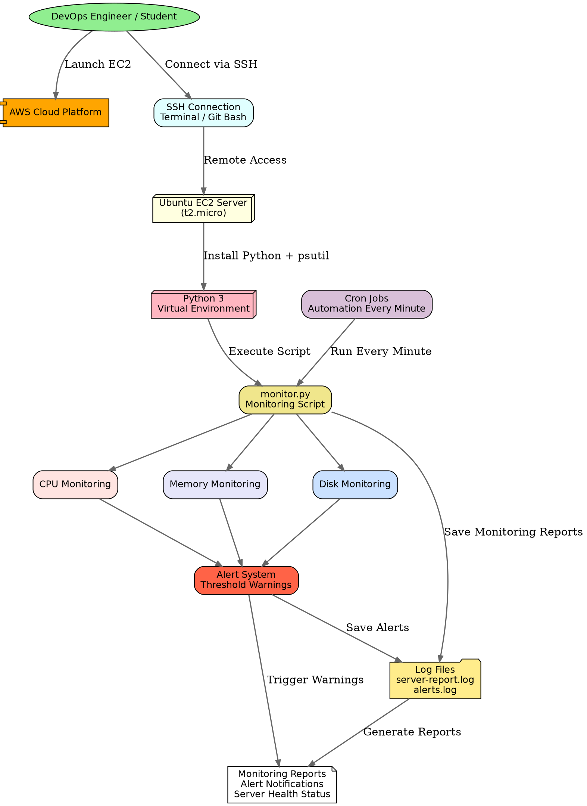
```dot
digraph AWS_Python_Monitoring_Architecture {

  rankdir=TB;
  splines=true;
  nodesep=0.8;
  ranksep=1.0;

  bgcolor="white";

  node [
    shape=box,
    style="rounded,filled",
    fillcolor=lightblue,
    color=black,
    fontname="Helvetica",
    fontsize=12
  ];

  edge [
    color=gray40,
    penwidth=1.5,
    arrowsize=0.8
  ];

  Student [
    shape=oval,
    fillcolor=lightgreen,
    label="DevOps Engineer / Student"
  ];

  AWS [
    shape=component,
    fillcolor=orange,
    label="AWS Cloud Platform"
  ];

  EC2 [
    shape=box3d,
    fillcolor=lightyellow,
    label="Ubuntu EC2 Server\n(t2.micro)"
  ];

  SSH [
    fillcolor=lightcyan,
    label="SSH Connection\nTerminal / Git Bash"
  ];

  Python [
    shape=box3d,
    fillcolor=lightpink,
    label="Python 3\nVirtual Environment"
  ];

  Script [
    fillcolor=khaki,
    label="monitor.py\nMonitoring Script"
  ];

  CPU [
    fillcolor=mistyrose,
    label="CPU Monitoring"
  ];

  Memory [
    fillcolor=lavender,
    label="Memory Monitoring"
  ];

  Disk [
    fillcolor=lightsteelblue1,
    label="Disk Monitoring"
  ];

  Alerts [
    fillcolor=tomato,
    label="Alert System\nThreshold Warnings"
  ];

  Logs [
    shape=folder,
    fillcolor=lightgoldenrod1,
    label="Log Files\nserver-report.log\nalerts.log"
  ];

  Cron [
    fillcolor=thistle,
    label="Cron Jobs\nAutomation Every Minute"
  ];

  Output [
    shape=note,
    fillcolor=white,
    label="Monitoring Reports\nAlert Notifications\nServer Health Status"
  ];

  Student -> AWS [
    label="Launch EC2"
  ];

  Student -> SSH [
    label="Connect via SSH"
  ];

  SSH -> EC2 [
    label="Remote Access"
  ];

  EC2 -> Python [
    label="Install Python + psutil"
  ];

  Python -> Script [
    label="Execute Script"
  ];

  Script -> CPU;
  Script -> Memory;
  Script -> Disk;

  CPU -> Alerts;
  Memory -> Alerts;
  Disk -> Alerts;

  Alerts -> Logs [
    label="Save Alerts"
  ];

  Script -> Logs [
    label="Save Monitoring Reports"
  ];

  Cron -> Script [
    label="Run Every Minute"
  ];

  Logs -> Output [
    label="Generate Reports"
  ];

  Alerts -> Output [
    label="Trigger Warnings"
  ];
}
```

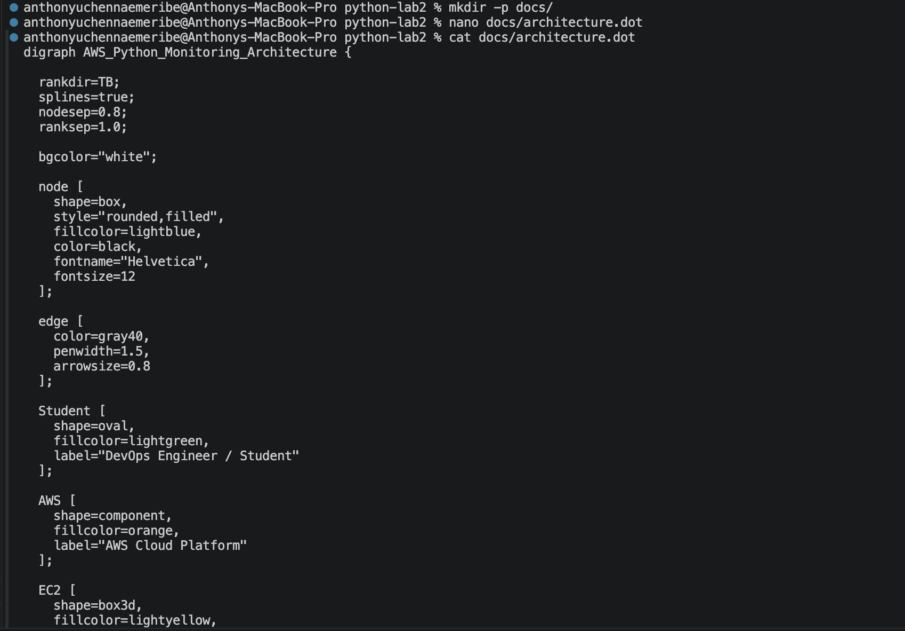

Generate architecture image:

```bash
dot -Tpng docs/architecture.dot -o docs/architecture-diagram.png
```

Generate SVG image:

```bash
dot -Tsvg docs/architecture.dot -o docs/architecture-diagram.svg
```

Open image:

```bash
open docs/architecture-diagram.png
```

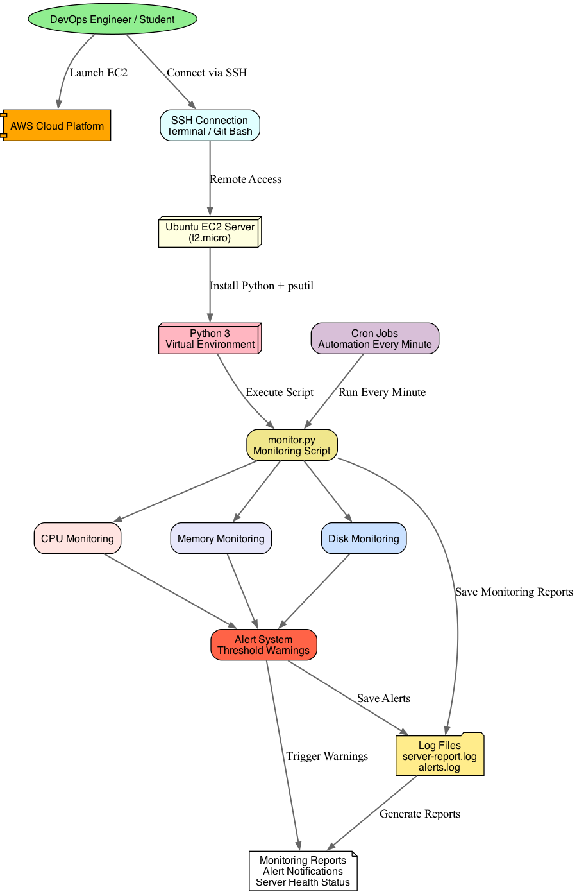
---

# 🚀 PART 1 — Configure AWS CLI

## 🎯 Objective

Install and configure AWS CLI locally.

---

# Step 1 — Verify AWS CLI Installation

Run:

```bash
aws --version
```

---

# ✅ Expected Output

```text
aws-cli/2.x.x
```
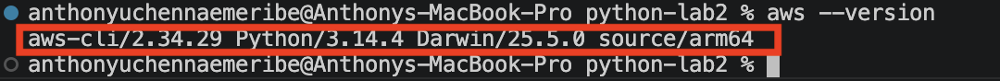

---

# Step 2 — Configure AWS CLI

Run:

```bash
aws configure
```

Provide:

```text
AWS Access Key ID
AWS Secret Access Key
Default region name
Default output format
```

Example:

```text
AWS Access Key ID [None]: AKIAXXXXXXXXX
AWS Secret Access Key [None]: xxxxxxxxx
Default region name [None]: us-east-1
Default output format [None]: json
```

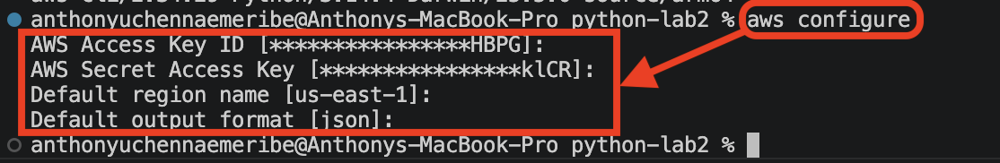

---

# Step 3 — Verify AWS Identity

```bash
aws sts get-caller-identity
```
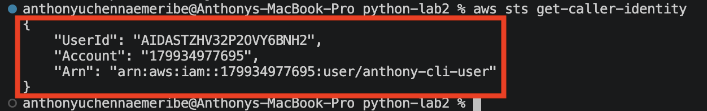
---

# 🚀 PART 2 — Launch AWS EC2 Server Using AWS CLI

## 🎯 Objective

Launch an Ubuntu EC2 instance using AWS CLI.

---

# Step 1 — Create Key Pair

```bash
aws ec2 create-key-pair --key-name devops-python-key --query 'KeyMaterial' --output text > devops-python-key.pem
```

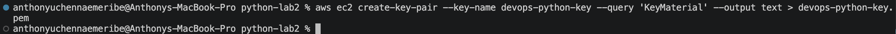
---

# Step 2 — Secure PEM File

```bash
chmod 400 devops-python-key.pem
```

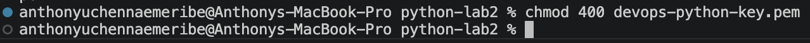
---

# Step 3 — Create Security Group

```bash
aws ec2 create-security-group --group-name python-monitoring-sg --description "Security group for Python monitoring project"
```

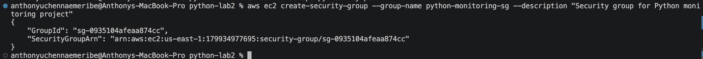
---

# Step 4 — Allow SSH Access

```bash
aws ec2 authorize-security-group-ingress --group-name python-monitoring-sg --protocol tcp --port 22 --cidr 0.0.0.0/0
```

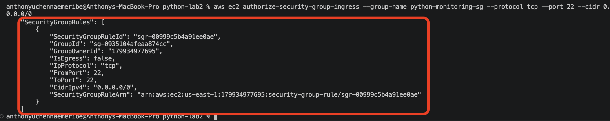

---

# Step 5 — Launch EC2 Instance

```bash
aws ec2 run-instances --image-id ami-0e86e20dae9224db8 --instance-type t2.micro --key-name devops-python-key --security-groups python-monitoring-sg --tag-specifications 'ResourceType=instance,Tags=[{Key=Name,Value=python-monitoring-server}]'
```

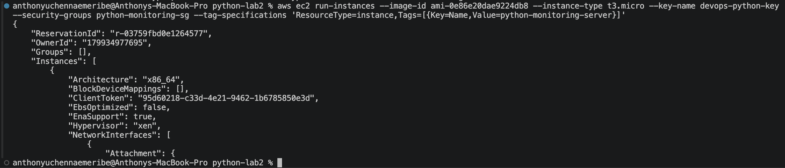
---

# Step 6 — View Running Instances

```bash
aws ec2 describe-instances --query 'Reservations[*].Instances[*].[InstanceId,PublicIpAddress,State.Name]' --output table
```

---

# ✅ Expected Output

```text
------------------------------------------
|           DescribeInstances            |
+----------------------+----------------+
| i-00406d97dbcaf9d17  | 54.82.126.81   |
| running              |                |
+----------------------+----------------+
```
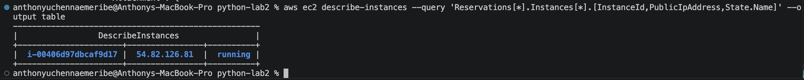
---

# 🚀 PART 3 — Connect to EC2 Server

## 🎯 Objective

Connect securely to the EC2 instance using SSH.

---

# Step 1 — SSH into Server

```bash
ssh -i devops-python-key.pem ubuntu@YOUR_PUBLIC_IP

# Substituting for the Public IP
ssh -i devops-python-key.pem ubuntu@54.82.126.81
```

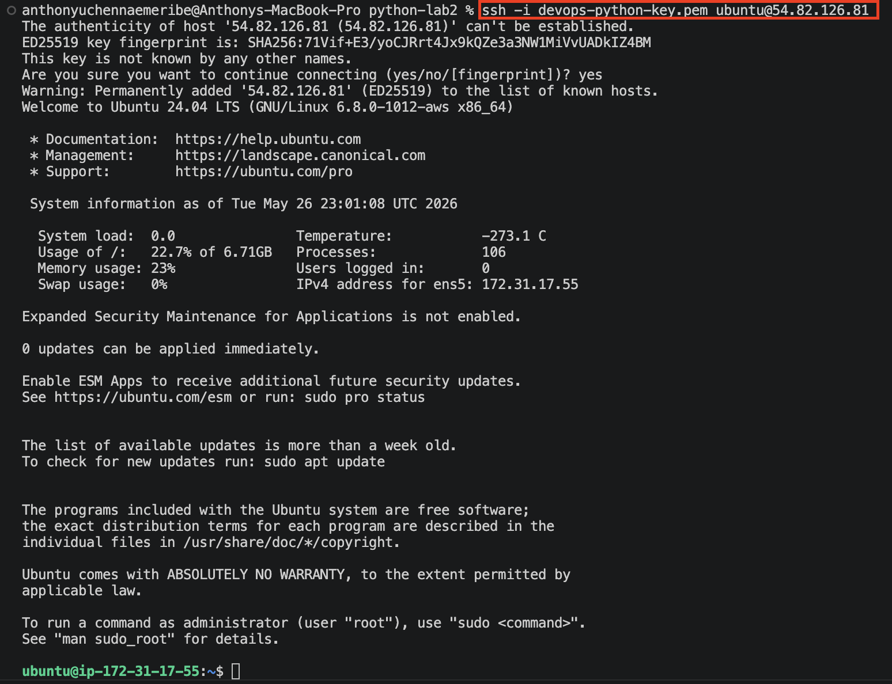

---

# 🚀 PART 4 — Install Python & Monitoring Tools

## 🎯 Objective

Install Python and monitoring dependencies.

---

# Step 1 — Update Server

```bash
sudo apt update
```
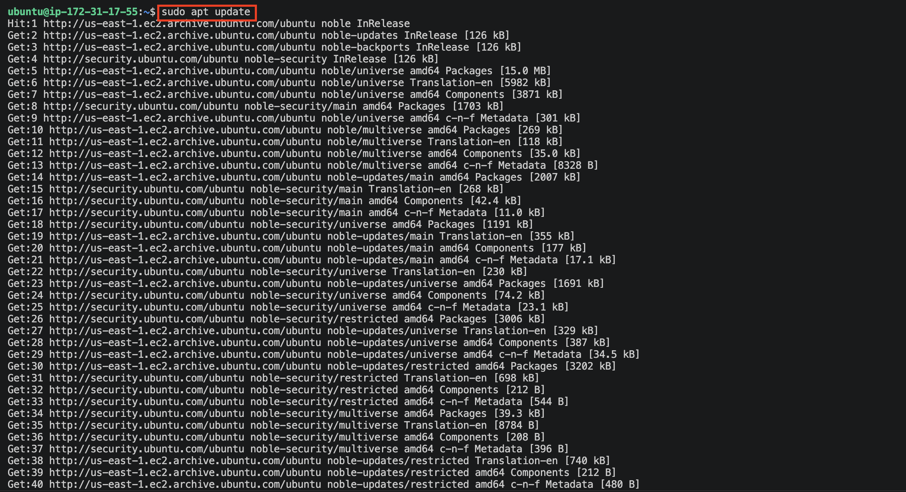
---

# Step 2 — Install Python

```bash
sudo apt install python3 python3-pip -y
```
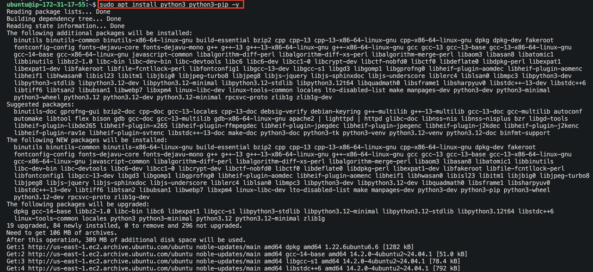
---

# Step 3 — Install Python Virtual Environment

```bash
sudo apt install python3-venv -y
```
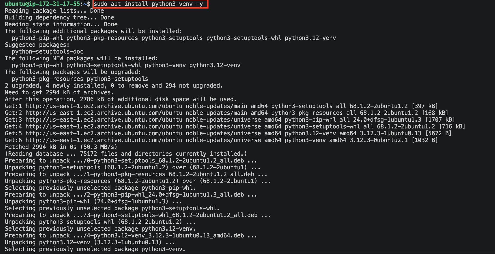
---

# Step 4 — Create Virtual Environment

```bash
python3 -m venv venv
```
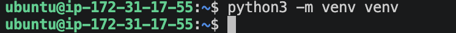
---

# Step 5 — Activate Virtual Environment

```bash
source venv/bin/activate
```

Expected:

```text
(venv) ubuntu@ip-172-31-22-10
```
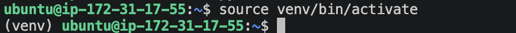
---

# Step 6 — Install psutil

## What is psutil?

`psutil` is a Python package used for:

- CPU monitoring
- Memory monitoring
- Disk monitoring

Install:

```bash
pip install psutil
```
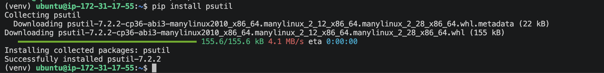
---

# Step 7 — Verify Installation

```bash
pip list
```

Expected output includes:

```text
psutil
```
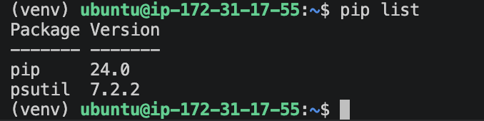
---

# 🚀 PART 5 — Create Monitoring Project

## 🎯 Objective

Create the monitoring project and monitoring script.

---

# Step 1 — Create Project Folder

```bash
mkdir monitoring-alert-project

cd monitoring-alert-project
```
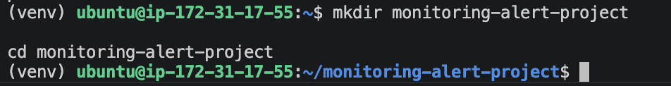
---

# Step 2 — Create Python Script

```bash
nano monitor.py
```

---

# 🚀 PART 6 — Add Monitoring & Alert Script

## 🎯 Objective

Build a Python server monitoring system.

---

# Step 1 — Add Monitoring Script

Paste:

```python
import psutil
import platform
from datetime import datetime

# ALERT THRESHOLDS
CPU_THRESHOLD = 80
MEMORY_THRESHOLD = 80
DISK_THRESHOLD = 80

print("======================================")
print(" AWS SERVER MONITORING & ALERT SYSTEM ")
print("======================================")

# SERVER NAME
hostname = platform.node()
print(f"Server Name: {hostname}")

# CURRENT TIME
now = datetime.now()
print(f"Time: {now}")

print("--------------------------------------")

# CPU USAGE
cpu_usage = psutil.cpu_percent(interval=1)
print(f"CPU Usage: {cpu_usage}%")

# MEMORY USAGE
memory = psutil.virtual_memory()
memory_usage = memory.percent
print(f"Memory Usage: {memory_usage}%")

# DISK USAGE
disk = psutil.disk_usage('/')
disk_usage = disk.percent
print(f"Disk Usage: {disk_usage}%")

print("--------------------------------------")

# ALERTS
if cpu_usage > CPU_THRESHOLD:
   print("ALERT: HIGH CPU USAGE!")

if memory_usage > MEMORY_THRESHOLD:
   print("ALERT: HIGH MEMORY USAGE!")

if disk_usage > DISK_THRESHOLD:
   print("ALERT: LOW DISK SPACE!")

# HEALTHY STATUS
if (
   cpu_usage < CPU_THRESHOLD and
   memory_usage < MEMORY_THRESHOLD and
   disk_usage < DISK_THRESHOLD
):
   print("SERVER STATUS: HEALTHY")

print("======================================")
```

---

# Step 2 — Save File

Press:

```text
CTRL + O
Enter
CTRL + X
```
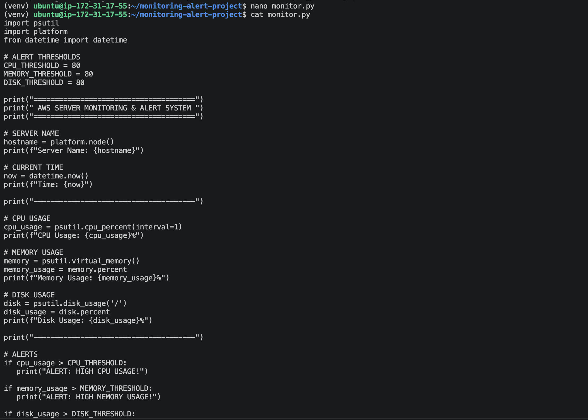
---

# 🚀 PART 7 — Run Monitoring Script

## 🎯 Objective

Execute the monitoring script.

---

# Step 1 — Run Script

```bash
python3 monitor.py
```

---

# ✅ Expected Output

```text
======================================
AWS SERVER MONITORING & ALERT SYSTEM
======================================
Server Name: ip-172-31-22-10
Time: 2026-05-14 11:30:12
--------------------------------------
CPU Usage: 25%
Memory Usage: 40%
Disk Usage: 30%
--------------------------------------
SERVER STATUS: HEALTHY
======================================
```
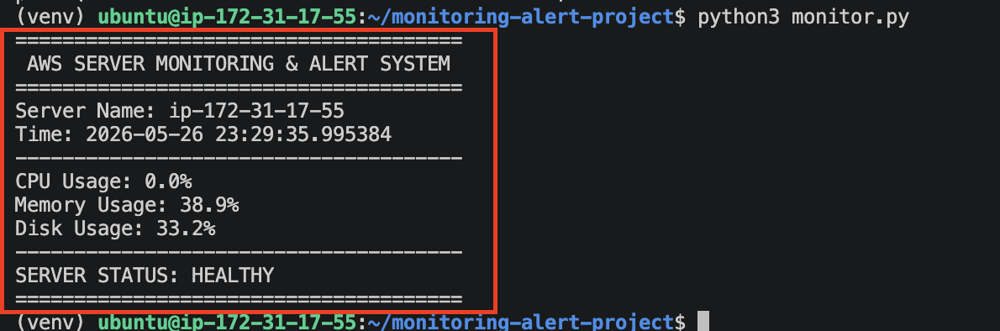
---

# 🚀 PART 8 — Save Monitoring Reports to Log File

## 🎯 Objective

Automatically save monitoring reports.

---

# Step 1 — Save Script Output

```bash
python3 monitor.py >> server-report.log
```
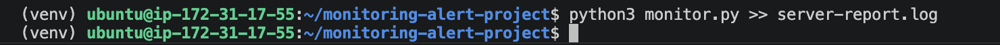
---

# Step 2 — View Log File

```bash
cat server-report.log
```
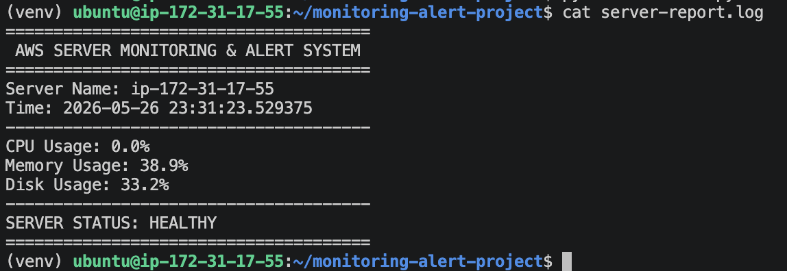
---

# 🚀 PART 9 — Automate Monitoring with Cron Jobs

## 🎯 Objective

Run monitoring automatically every minute.

---

# Step 1 — Open Cron Editor

```bash
crontab -e
```

Choose:

```text
Nano Editor
```

---

# Step 2 — Add Cron Job

```bash
* * * * * /usr/bin/python3 /home/ubuntu/monitoring-alert-project/monitor.py >> /home/ubuntu/monitoring-alert-project/server-report.log
```

---

# Step 3 — Save and Exit

Press:

```text
CTRL + O
Enter
CTRL + X
```
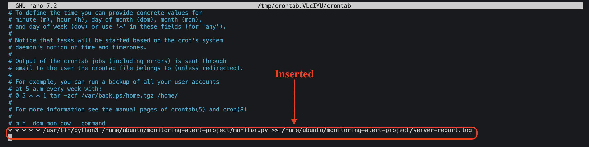
---

# Step 4 — Verify Automation

Wait 1 minute then run:

```bash
cat server-report.log
```

---

# ✅ Expected Result

Multiple monitoring reports appear automatically.

---

# 🚀 PART 10 — Simulate Alert Conditions

## 🎯 Objective

Generate real monitoring alerts.

---

# Step 1 — Install Stress Tool

```bash
sudo apt install stress -y
```
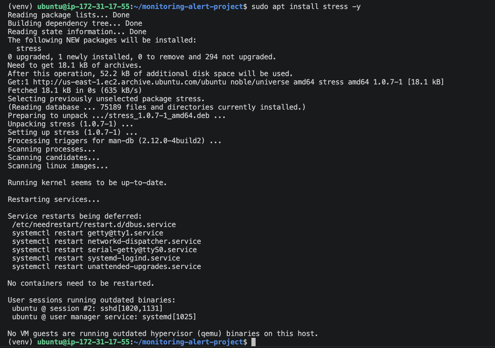
---

# Step 2 — Run CPU Stress Test

```bash
stress --cpu 2 --timeout 60
```
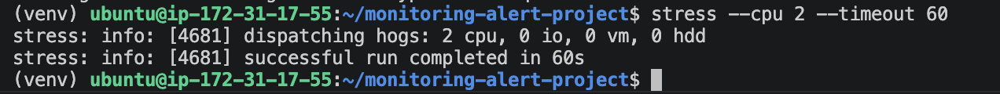
---

# Step 3 — Run Monitoring Script Again

```bash
python3 monitor.py
```

---

# ✅ Expected Alert Output

```text
ALERT: HIGH CPU USAGE!
```
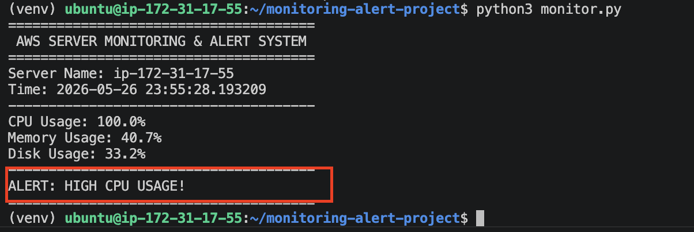
---

# 🚀 PART 11 — Create Real Alert Log File

## 🎯 Objective

Save alerts into a dedicated alert log file.

---

# Step 1 — Edit Script

```bash
nano monitor.py
```

---

# Step 2 — Add Alert Logging Section

Add below alert checks:

```python
alert_file = open("/home/ubuntu/monitoring-alert-project/alerts.log", "a")

if cpu_usage > CPU_THRESHOLD:
   alert_file.write(f"{now} - HIGH CPU USAGE\n")

if memory_usage > MEMORY_THRESHOLD:
   alert_file.write(f"{now} - HIGH MEMORY USAGE\n")

if disk_usage > DISK_THRESHOLD:
   alert_file.write(f"{now} - LOW DISK SPACE\n")

alert_file.close()
```

---

# Step 3 — Save File

Press:

```text
CTRL + O
Enter
CTRL + X
```
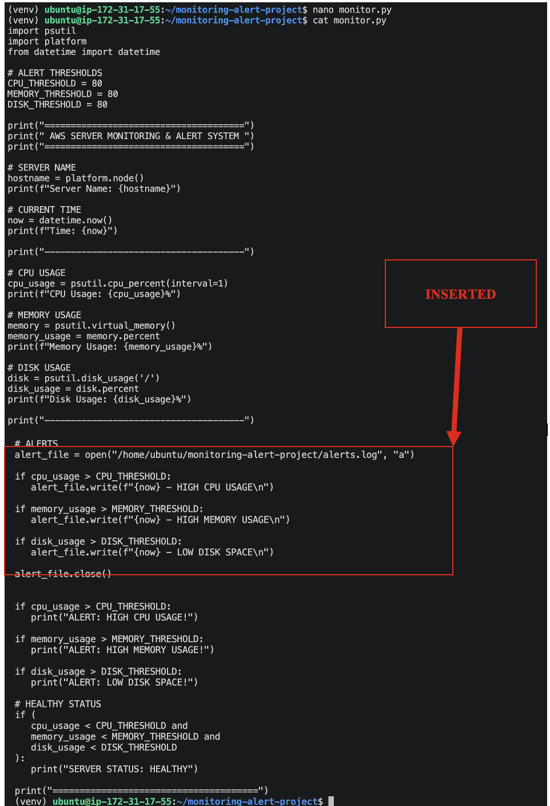
---

# Step 4 — Run Script Again

```bash
python3 monitor.py
```
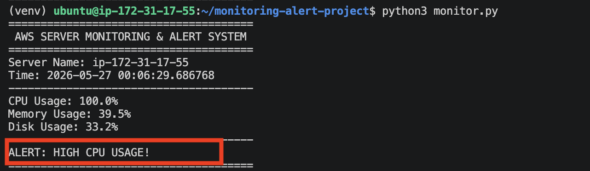
---

# Step 5 — View Alert Logs

```bash
cat alerts.log
```

---

# ✅ Expected Output

```text
2026-05-14 11:42:10 - HIGH CPU USAGE
```
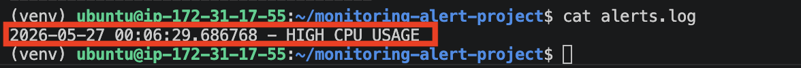

# 🚀 LAB 12 — Create .gitignore file

Create:

```bash
nano .gitignore
```

Add:

```gitignore
# Python Virtual Environment
venv/

# Python Cache
__pycache__/
*.pyc
*.pyo
*.pyd

# Log Files
*.log
server-report.log
alerts.log

# Environment Variables
.env

# macOS Files
.DS_Store

# Windows Files
Thumbs.db

# VS Code
.vscode/

# Terraform (if later added)
.terraform/
*.tfstate
*.tfstate.*

# AWS Credentials
.aws/

# SSH Keys
*.pem
*.key

# Temporary Files
*.tmp
*.bak
```
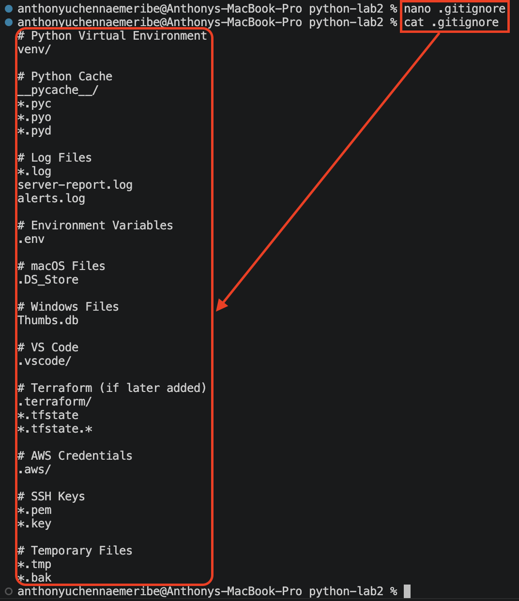

# LAB 13 - Update GitHub Repo

1. Authenticate GitHub CLI:

```bash
gh auth login
```
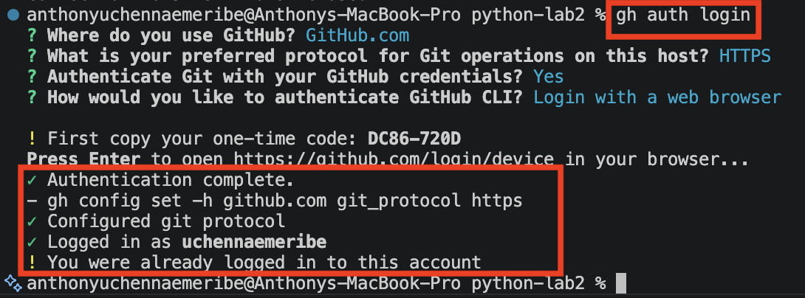

2. Initialize Git:

```bash
git init
```
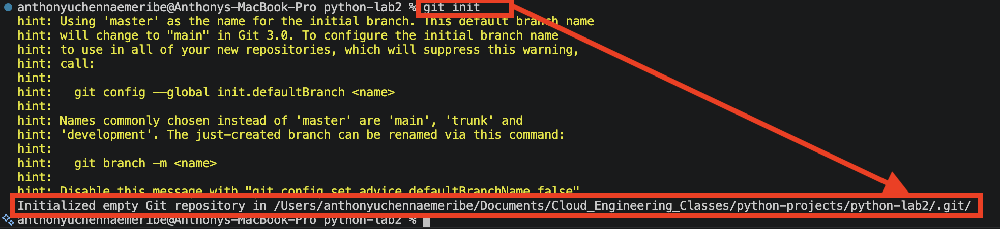

3. Add files:

```bash
git add .
```
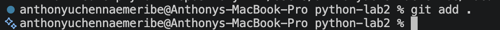

4. Commit:

```bash
git commit -m "Update README.md"
```
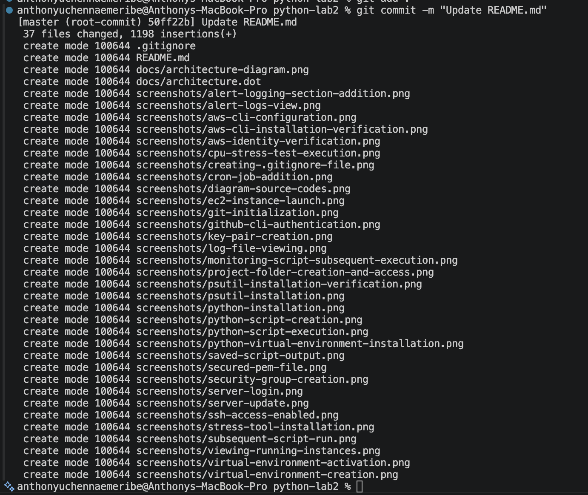

5. Rename branch:

```bash
git branch -M main
```
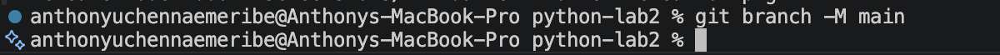

6. Create GitHub repository:

```bash
gh repo create python-lab-2 --public --source=. --remote=origin --push
```
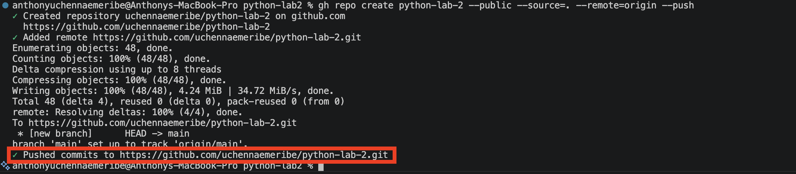
---

# 🚀 Final Project Structure

```text
monitoring-alert-project/
│
├── monitor.py
├── server-report.log
├── alerts.log
└── README.md
```

---

# 🧠 Real DevOps Concepts Learned

| Skill | What Student Did |
|---|---|
| AWS CLI | Provisioned EC2 infrastructure |
| AWS Cloud | Created cloud server |
| Linux | Connected using SSH |
| Python | Built automation script |
| Monitoring | Checked server health |
| Alerting | Generated warnings |
| Logging | Saved reports |
| Automation | Used cron jobs |

---

# 🎯 Final Outcome

You now understand:

✅ AWS CLI basics  
✅ EC2 provisioning using CLI  
✅ Linux server administration  
✅ Python automation scripting  
✅ CPU monitoring  
✅ Memory monitoring  
✅ Disk monitoring  
✅ Alert generation  
✅ Log management  
✅ Cron job automation  
✅ Real-world server monitoring  

---

# 👨‍💻 Author

**Anthony Uchenna Emeribe**  
Cloud / DevOps Engineer

---

# ⭐ Support

If this project helped you learn Python monitoring and cloud automation, consider giving the repository a ⭐ on GitHub.